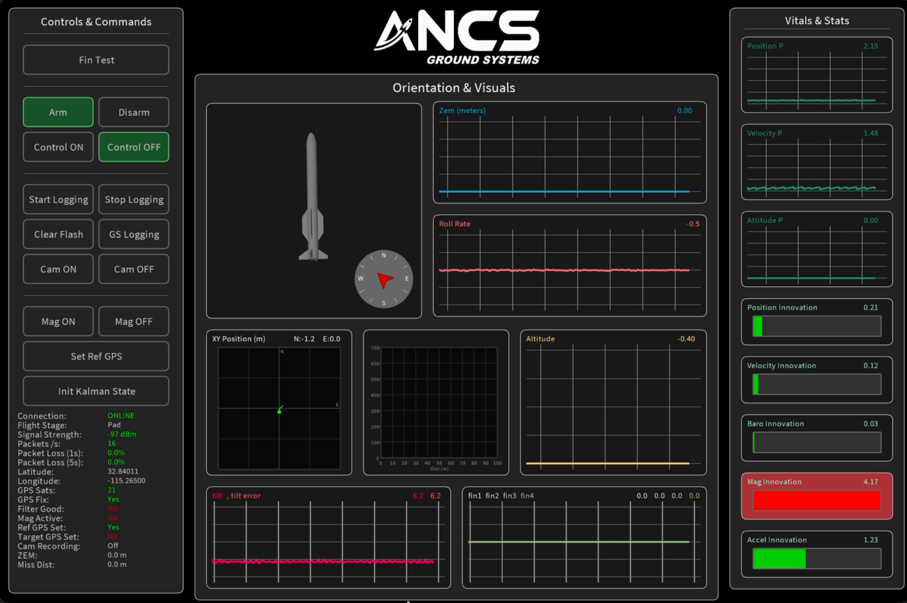

# ANCS Ground Systems — Real-Time Flight Computer GUI

  

This is a custom-built **Ground System GUI** developed in **Processing (Java)** for real-time telemetry visualization and command interface with an actively guided rocket's flight computer. It provides live orientation display, sensor data graphing, navigation filter diagnostics, and direct hardware control — all over a wireless serial link.

---

## Overview

The GUI connects to the flight computer over a serial radio link and continuously receives streamed telemetry packets. It parses and visualizes sensor and navigation data in real time, while exposing controls for arming, actuator testing, sensor calibration, and data logging.

The interface is organized into three main sections:

**Controls & Commands (left panel)** — Hardware interaction including arming/disarming, enabling/disabling active guidance control, fin actuator testing, onboard and ground-station data logging, camera toggling, magnetometer enable/disable, GPS reference setting, and Kalman filter state initialization.

**Orientation & Visuals (center panel)** — A 3D rocket model that rotates in real time based on attitude estimates, a compass rose showing heading, and telemetry graph panels for:
- **ZEM (Zero-Effort Miss)** — predicted miss distance in meters
- **Roll Rate** — angular rate about the roll axis
- **XY Position** — north/east position relative to the reference GPS point
- **Altitude** — barometric/GPS altitude profile
- **Tilt & Tilt Error** — current tilt angle vs. commanded tilt
- **Fin Deflections** — individual fin angles (fin1–fin4)

A live status block displays connection state, flight stage, signal strength, packet rate and loss, GPS coordinates, satellite count, fix quality, filter health flags, magnetometer status, camera state, ZEM, and miss distance.

**Vitals & Stats (right panel)** — Kalman filter innovation monitors showing real-time estimation health for:
- Position P
- Velocity P
- Attitude P
- Position Innovation
- Velocity Innovation
- Baro Innovation
- Mag Innovation
- Accel Innovation

Each innovation metric includes a numeric readout and a bar gauge with color coding (green = healthy, red = diverging), giving immediate visual feedback on filter convergence and sensor consistency.

---

## Technical Summary

| Detail | Description |
|---|---|
| **Language** | Java (Processing) |
| **Runtime** | Processing IDE using `P3D` for 3D rendering and `processing.serial` for serial communication |
| **Input** | Packetized telemetry over serial radio at 115200 baud |
| **3D Model** | OBJ rocket model rendered via `PShape` with real-time attitude rotation |
| **Graphing** | Custom-drawn rolling line graphs with labeled axes and live value readouts |
| **Architecture** | Serial packets → parsed → stored in rolling data arrays → visualized each frame in `draw()` loop |

---

## Key Features

- **Real-time telemetry visualization** with custom-built graphing for altitude, roll rate, position, tilt, fin angles, and ZEM.
- **3D attitude display** driven by live roll, pitch, and yaw data with compass heading indicator.
- **Kalman filter diagnostics** — innovation monitors for position, velocity, barometric, magnetometer, and accelerometer measurements with color-coded health bars.
- **Hardware command interface** — arm/disarm, control enable/disable, fin test, magnetometer toggle, camera control, and GPS reference setting directly from the GUI.
- **Dual logging modes** — onboard flash logging and ground-station-side logging with independent start/stop controls.
- **Navigation state management** — initialize Kalman filter state and set reference GPS coordinates pre-flight.
- **Connection health monitoring** — live signal strength (dBm), packet rate, packet loss (1s and 5s windows), and GPS satellite/fix status.
- **Live serial communication** with flight hardware for responsive, low-latency updates.
- **Modular panel architecture** for adding new telemetry channels or control features.

---

## Development Goals

This project was developed to:

- Build a complete ground station interface for an actively guided rocket with real-time navigation feedback.
- Integrate embedded flight computer telemetry with real-time 3D visualization and filter diagnostics.
- Provide pre-flight and in-flight command capability over a wireless serial link.
- Design a data-dense but readable engineering interface without relying on external plotting or UI libraries.
- Demonstrate proficiency in serial communication, navigation filter monitoring, and real-time data-driven GUI design.
